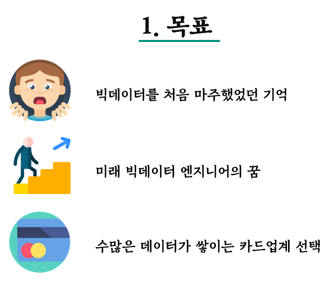
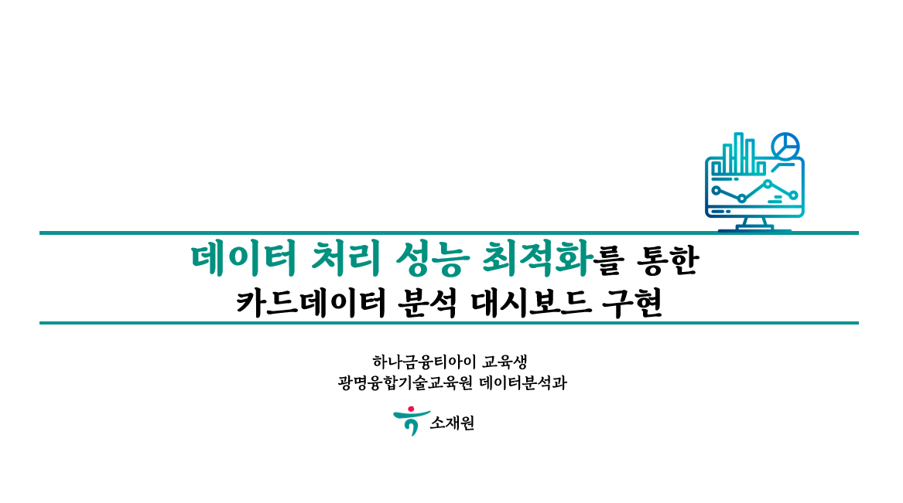

# 프로젝트 제목

[프로젝트 홈페이지 - https://koposoftware.github.io/2020_3_jwso/](https://koposoftware.github.io/2020_3_jwso/)

# 1. 프로젝트 개요

카드업계에서는 손님의 카드 결제내역이나 인구통계학적인 
 내부 데이터도 중요하지만, 사회적 이슈, 트렌드와 같은
 외부 이슈도 중요합니다.

 따라서, 다양한 정보의 원천 중에서도 내부 데이터를 시각화하여
 대시보드 형태로 접근할 수 있다면, 시간을 절약하여 전반적인
 카드 관련 프로세스의 효율을 높일 수 있을 것으로 생각합니다.

 개인적인 목표는, 정보계 및 계정계, ETL 등 현업과 유사한 
 형태를 경험해보고자 하였고, 빅데이터를 핸들링했을 때의 
 어려움을 직접 겪어보고 극복하는 학습을 목표로 삼았습니다. 

# 2. 프로젝트 목표
    

# 3. 프로젝트 결과

## 발표 ppt 
   [발표자료](/프로젝트.pdf) 

## 시연 동영상 
<iframe width="822" height="462" src="https://www.youtube.com/embed/zs3lhnsFULM" frameborder="0" allow="accelerometer; autoplay; clipboard-write; encrypted-media; gyroscope; picture-in-picture" allowfullscreen></iframe>

# 4. 본인 소개

본인 소개를 추가하세요

|이름 |소재원||
|연락처 | 2060340004(@)kopo.ac.kr|
|skill set| Frontend - HTML, CSS, Javascript, Jquery|
| | Backend - Java, Spring, Oracle |
|자격증| 정보처리기사, ADsP, OPIc IM2  |
|수상| 2016 UNIST Bigdata Analysis Competition 최우수상 |
